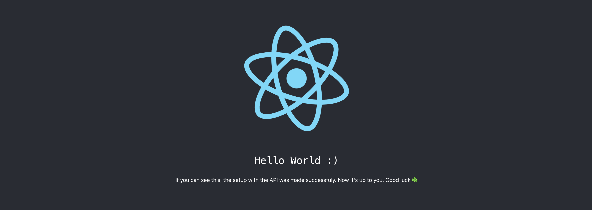

# Frontend Recruitment Test

This is the `frontend` boilerplate for the test to join the Hubs Contabilidade Technology Team. Welcome!

The purpose of this test is to assess your logical reasoning ability, as well as your frontend coding skills, system integrations, code organization, creativity, independence, and problem-solving.

## The challenge

A customer has requested a very simple `enterprises` management system. Your role is to structure a CRUD-type interface that allows `enterprises` to be visualized, registered, modified and removed from the application. Then, you must integrate these actions with the server though the GraphQL API. You will find the `backend` boilerplate [here](https://github.com/hubs-contabilidade/frontend-recruitment-test). This integration is only required for FullStack Engineering roles. Make sure to check this out before you start to code anything.

### Important notes

- The repository does not have any component or style libraries installed. This is up to your discretion and creativity, so feel free to install and use whatever you feel more confortable with. You can even not use any if you want to;
- To make the process easier for you, we have provided a pre-configured `GraphQL client` and a `GraphQL code generator`. If you don't know where to start from, check out the [apollo-client](https://www.apollographql.com/docs/react) and [codegen](https://the-guild.dev/graphql/codegen/docs/guides/react-vue) docs;
- You can install code linters and formatters of your choice, as well as organize the project folder structure as you see fit;
- There is no pre-configured routing system. Keep this in mind when programming structures that need to be arranged in different routes.

### What will be evaluated

- The overall organization of your code;
- The technical level of the implementation;
- The level of creativity of the implementation.

### What we don't recommend doing

- Asking someone to code your test for you;
- Using code generated by AI like ChatGPT or Gemini (we want to evaluate your skills, not the AI's);
- Changing the scope of the project too much;
- Wasting a lot of time doing cool but not very useful things. It's tempting, but focus on finishing what the test asks for first :)

### What we would like to see (but it is not mandatory)

- Beautiful, responsive layouts;
- Integration with component documentation and testing tools, such as Storybook;
- Unit tests.

> Please keep in mind that we’re not evaluating whether you can build up an application with a million complex features. Do what you can within your available time. However, remember that the more things you can show, the more points your test will potentially earn.

The rest is up to you! Good luck!

## General instructions

> To run this test, we assume that you already have finished the `backend` setup and have it up and running on your machine. If not, check the steps to achieve it [here](https://github.com/hubs-contabilidade/backend-recruitment-test?tab=readme-ov-file#general-instructions). Also, you’ll need to have `Node >= 14` on your local development machine.

To start your `React` server:

- Fork and clone this repository so you can version your changes;
- Run `yarn && yarn start` to install dependencies and start the server;
- You can now view the application in the browser.

