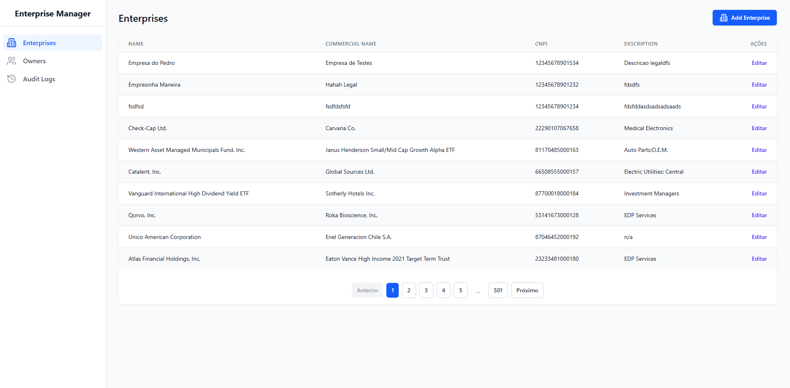

# Sistema de Gerenciamento de Empresas - Frontend

<div align="center">
  
</div>

## 📋 Sobre o Projeto

Este é o frontend do Sistema de Gerenciamento de Empresas, desenvolvido com **React** e **TypeScript**. A aplicação consome uma **API GraphQL** e oferece uma interface moderna e responsiva para gerenciar empresas e seus proprietários.

## 🚀 Funcionalidades

- Interface intuitiva para gerenciamento de empresas e proprietários
- Dashboard com visualização de dados em tempo real
- Integração completa com API GraphQL
- Layout responsivo e moderno
- Validação de formulários

## 🛠️ Tecnologias Utilizadas

- **React 18+**: Biblioteca JavaScript para construção de interfaces
- **TypeScript**: Superset tipado do JavaScript
- **Apollo Client**: Cliente GraphQL para gerenciamento de dados
- **React Router**: Gerenciamento de rotas na aplicação
- **Zod**: Validação de schemas para formulários

## ⚙️ Pré-requisitos

- **Node.js** 16 ou superior
- **yarn**
- Backend GraphQL em execução

## 🔧 Configuração do Ambiente

1. **Clone o repositório:**

```bash
git clone https://github.com/seu-usuario/frontend-recruitment-test.git
cd frontend-recruitment-test
```

2. **Configure as variáveis de ambiente:**

```bash
cp .env.example .env
# Edite o arquivo .env com suas configurações
```

3. **Instale as dependências:**

```bash
yarn install
```

4. **Inicie o servidor de desenvolvimento:**

```bash
yarn start
```

A aplicação estará disponível em **localhost:3000**.

## 📊 Estrutura do Projeto

```
frontend-recruitment-test/
├── src/
│   ├── assets/             # Arquivos estáticos
│   ├── components/         # Componentes reutilizáveis
│   ├── hooks/              # Hooks customizados
│   ├── pages/              # Páginas da aplicação
│   ├── schemas/            # Definições de schemas
│   ├── services/           # Serviços e integrações
│   └── types/              # Definições de tipos
└── public/                 # Arquivos estáticos publicos
```

## 🗒️ Principais Componentes

- **DataTable**: Tabela de dados com paginação e filtros
- **Dashboard**: Painel principal com métricas
- **Layout**: Estrutura base da aplicação
- **Pagination**: Componente de paginação

## 🧪 Testes

Execute os testes com (Sem testes implementados até o momento):

```bash
yarn test
```

Para verificar a cobertura de testes:

```bash
yarn test --coverage
```

## 🚀 Deploy

### Usando Vercel

1. Conecte seu repositório à **Vercel**
2. Configure as variáveis de ambiente na plataforma
3. O deploy será feito automaticamente a cada push

### Build Manual

```bash
yarn build
```

## 📄 Licença

Este projeto está sob a licença **MIT**.